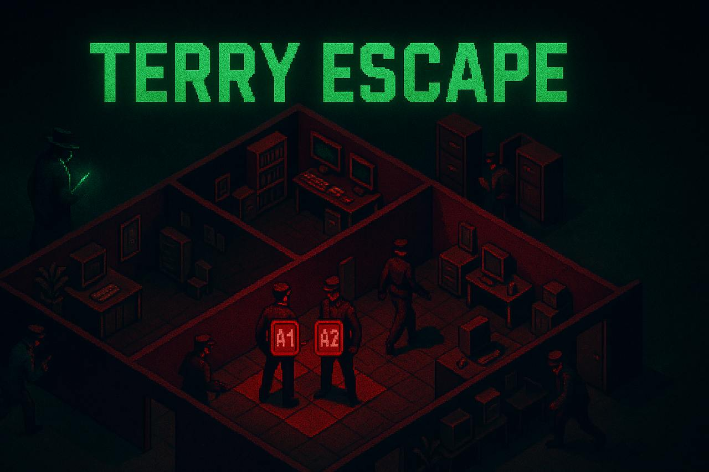

# Terry Escape



## Quick Start - Complete Setup Guide

### Prerequisites
- **Docker** and **Docker Compose** (required)
- **Git** (required)
- **4 players** (exactly 4 needed to start a game)

### Installation & Setup

#### Step 1: Clone the Repository
```bash
git clone https://github.com/your-repo/terry-demo.git
cd terry-demo
```

#### Step 2: Run the Setup Script
```bash
# Make scripts executable (if needed)
chmod +x setup.sh lan-party.sh

# Run the setup
./setup.sh
```

This will:
- Stop any existing containers
- Build the Docker image (takes 2-3 minutes first time)
- Start both the frontend and game server
- Display URLs for accessing the game

#### Step 3: Test the Setup

**For Single Computer Testing (4 browser tabs):**
1. Open http://localhost:8000 in 4 different browser tabs (or use different browsers)
2. In each tab:
   - Enter a different username (e.g., Player1, Player2, Player3, Player4)
   - Click "ENTER LOBBY"
3. First player: Click "CREATE ROOM"
4. Other 3 players: Click "JOIN" on the created room
5. Game starts automatically when 4th player joins!

**For LAN Party (4 different computers):**
```bash
# Instead of setup.sh, use:
./lan-party.sh
```
- Share the displayed IP address with your friends
- Everyone must be on the same WiFi network
- Each player goes to http://YOUR-IP-ADDRESS in their browser

### How to Play - Complete Guide

#### Game Phases

1. **Lobby Phase** (Before Game)
   - Enter your username
   - Either create a new room or join an existing one
   - Wait for exactly 4 players to join

2. **Deployment Phase** (60 seconds)
   - Each player gets one corner of the board (highlighted cells)
   - Click on your highlighted cells to place your 4 agents
   - You MUST place all 4 agents before time runs out
   - Agents appear as "A1", "A2", "A3", "A4"

3. **Battle Phase** (Turn-based)
   - Players take turns in order
   - When it's your turn (30 seconds to act):
     - Choose an action: MOVE or TRAP
     - Click on one of your agents
     - Click on an adjacent cell (up/down/left/right only)
   - When it's not your turn:
     - Watch the game log for activity
     - Your client is still active (helping with MPC calculations)

#### Combat Rules

- **Collision**: If two agents enter the same cell → Both die!
- **Trap Hit**: If an agent steps on a trap → Agent dies, trap is consumed
- **Direct Trap**: If you place a trap on an enemy → Enemy dies instantly
- **Timeout**: Don't act in 30 seconds → ALL your agents die!

#### Winning
- Last player with living agents wins
- If you lose all agents, stay connected! The game needs you for MPC

### Troubleshooting

#### Docker Issues
```bash
# Check if containers are running
docker ps

# View logs
docker compose logs -f

# Restart everything
docker compose down
./setup.sh
```

#### Connection Issues
- **"Cannot connect"**: Make sure Docker is running
- **"Game full"**: Games need exactly 4 players, no more, no less
- **LAN party issues**: Check firewall settings (port 80 and 2448)

#### Common Problems & Solutions

1. **Build fails**: 
   ```bash
   # Clear Docker cache and rebuild
   docker system prune -a
   ./setup.sh
   ```

2. **Port already in use**:
   ```bash
   # Stop conflicting services
   sudo lsof -i :8000  # Find what's using port 8000
   sudo lsof -i :2448  # Find what's using port 2448
   # Kill the process or change ports in docker-compose.yml
   ```

3. **Game won't start**: 
   - Need exactly 4 players connected
   - All players must click JOIN before deployment timer starts

### Development Setup (Optional)

If you want to modify the code:

```bash
# Install Node.js 20+ and pnpm first
npm install -g pnpm

# Install dependencies
pnpm install

# Terminal 1 - Backend
cd packages/gamemaster
pnpm dev

# Terminal 2 - Frontend  
cd packages/frontend
pnpm dev

# Access at http://localhost:8000
```

### Quick Command Reference

```bash
# Start game (local)
./setup.sh

# Start game (LAN party)
./lan-party.sh

# Stop game
docker compose down

# View logs
docker compose logs -f

# Rebuild after code changes
docker compose build --no-cache
```

## Game Strategy Tips

- **Control the center** - More movement options
- **Set trap chains** - Create defensive zones
- **Watch the log** - Learn from enemy movements
- **Active player advantage** - You survive collisions when it's your turn!
- **Corner camping** - Risky but sometimes effective

## Technical Details

### Architecture
- **Frontend**: TypeScript + vanilla JS (no framework)
- **Backend**: Node.js + Socket.io game server
- **Security**: Zero-knowledge proofs ensure fair play without revealing positions
- **MPC**: All players participate in secure multi-party computation

### Ports Used
- **8000**: Frontend web server
- **2448**: Game server (WebSocket)

### How It Works
The game uses cryptographic proofs to hide player positions while ensuring fair play. Each turn involves:
1. Non-active players query for information (encrypted)
2. Active player responds with proof of valid move
3. All players verify the proofs
4. State updates without revealing actual positions

This means players can't cheat or see enemy positions, making the game both fair and strategic!

## Game mechanics

Multiple untrusting factions compete to take control over a strategically placed building complex.
Each group has the same amount of agents, ready to be deployed on rooms of disjoints initial sets.
Every epoch, command centers instruct one agent to either move or send a trap to an adjacent room.
If any agent shares time and space with a trap or some agent of another team, both get anihilated.
Given respect and etiquette, agencies engage in multiparty-computation to track respective agents.
After losing all of its agents, factions informs so. The dispute is settled when only one remains.

## Circuit architecture

Each agency commits to its deployed agents and traps by publishing its hash, along with some salt.
Ideally, verifiable MPC tools would be leveraged but existing ones only work for 3 honest parties.
New circuits are proposed to engage and prove messages validity from multiple oblivious transfers.
After having created these proofs, agencies can justify state hash updates leaking no information.

### Involved circuits (with abstracted details)

`π_keypair(decryption key, entropy, pub encryption key, pub decryption key hash)`\
    Used to prove valid keypair generation, and use the same decryption key later.

`π_encrypt(entropy, pub message, pub encryption key, pub ciphertext)`\
    Used to prove valid (message, ciphertext) pairs, for an unkown encryption key.\
    (Note: this is the current performance bottleneck, but can be proved offline.)

`π_deploys(agent positions, state salt, pub state digest)`\
    Used to prove valid intial state, and use it as starting point for evolutions.

`π_queries(state, salt, pub digest, π_encrypt, pub oblivious selectors, pub queries)`\
    Used to prove valid oblivious transfers queries, dependent of a private state.

`π_answers(state, salt, pub digest, π_queries, key, pub key hash, action, pub action hash, pub answers)`\
    Used to prove valid oblivious transfers answers, dependent of a private state.

`π_updates(old state, old salt, pub old digest, new state, new salt, pub new digest, π_answers, pub report)`\
    Used to prove valid state update after receiving responses from a moving team.

`π_reports(old (state, salt, pub digest), new (state, salt, pub digest), π_updates, key, action, pub hashes)`\
   Used to prove valid moving team state update after receiving private reports from others.

## Extra report notes:

+ Found and fixed bugs in [noir-bignum library](https://github.com/noir-lang/noir-bignum/pull/76)

+ Found error in proposed operations bit-size
    - During the writing of the proposal, a miscalculation was made concerning required bitlengths.
    - This was caused by misinterpretation of poly-logarithmic terms in Landau notations (O vs. Õ).
    - Correcting this error introduces a ×3 factor in cyphertext lenght, growing from ~370 to 1031.

+ Found necessity of bignum-paramgen web port
    - In order to develop a web client the [paramgen crate](https://crates.io/crates/noir-bignum-paramgen) must be called from within a web context.

+ Coded circuits for state queries and update
    - Main circuits structure defined, would enable gameplay if verified right
    - Auxiliary circuits to encrypt and decrypt board data got implemented too
    - WIP: automated simulation example game flow, that interoperates circuits
    - TODO: combine state update validation proofs in single aggregating proof

+ Found vulneravility for the proposed scheme
    - Cyphertext distribution is observationally uniform, only without knowledge of decryption key.
    - Knowing such key, allows decription of the message, and of the exact noise in the sample too.
    - The encryption process outputs samples whose noise is a sum of uniformly distributed numbers.
    - Malicious agents may infer private data by statistical analisys of Irwin–Hall distribuitions.
    - The concrete feasibility of such attack is yet to be determined, but this might be mitigated.

Alternative schemes with uniform (re)encryption, that are also potentially feasible exists, such as the one presented [here](https://crypto.stanford.edu/~dabo/papers/2dnf.pdf), but would require provable composite-order elliptic curve operations. (Note: should not be directly implemented from supersingular curves, [since there are insecure](https://fse.studenttheses.ub.rug.nl/22732/1/bMATH_2020_SmitR.pdf).) (Note 2: this type of scheme seems to also allow for offline precomputation of reencryption parameters, potentially reducing in-game proving times.)