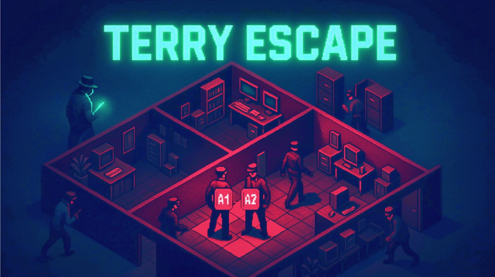

# Terry Escape



## 🎮 Quick Start - Local Setup

### Prerequisites
- Docker and Docker Compose
- Node.js 20+ (for development)
- Git

### Option 1: LAN Party Mode (Recommended for Playing)
```bash
# Clone and setup
git clone <repository-url>
cd terry-demo
./setup.sh

# Start LAN party mode
./lan-party.sh

# Share the displayed IP with friends on same WiFi!
```

### Option 2: Development Mode
```bash
# Install dependencies
pnpm install

# Start frontend (terminal 1)
cd packages/frontend
pnpm dev

# Start backend (terminal 2)
cd packages/gamemaster
pnpm dev

# Open http://localhost:8000 in browser
```

## 🎯 How to Play

### Game Flow
1. **Lobby Phase**: Create or join a game room
2. **Waiting Phase**: Need exactly 4 players to start
3. **Deployment Phase**: 60 seconds to place your 4 agents on your colored cells
4. **Battle Phase**: Take turns moving agents or placing traps

### Rules
- **Movement**: Agents can move to adjacent cells (horizontal/vertical only)
- **Traps**: Place invisible traps on adjacent cells
- **Combat**: When an agent meets an enemy agent or trap, both are eliminated
- **Victory**: Last player with surviving agents wins

### Game Logic Explained
The game uses **Multi-Party Computation (MPC)** with zero-knowledge proofs to ensure:
- Players can't see enemy positions
- Moves are validated without revealing locations
- No cheating is possible (can't move to invalid cells, can't move twice, etc.)

Each turn follows this cryptographic protocol:
1. **Query Phase**: All players request position information
2. **Answer Phase**: Active player responds with encrypted data
3. **Update Phase**: All players update their local state
4. **Report Phase**: Active player proves their move was valid

This ensures the game remains fair while keeping all positions secret!

## Game mechanics

Multiple untrusting factions compete to take control over a strategically placed building complex.
Each group has the same amount of agents, ready to be deployed on rooms of disjoints initial sets.
Every epoch, command centers instruct one agent to either move or send a trap to an adjacent room.
If any agent shares time and space with a trap or some agent of another team, both get anihilated.
Given respect and etiquette, agencies engage in multiparty-computation to track respective agents.
After losing all of its agents, factions informs so. The dispute is settled when only one remains.

(Note: could be aquatic warfare, but nowadays is too complex and analogies break.)

(Noir Submarines: 🎶️"In the land of UltraHonk, lived a prover, with higher speed")


## Circuit architecture

Each agency commits to its deployed agents and traps by publishing its hash, along with some salt.
Ideally, verifiable MPC tools would be leveraged but existing ones only work for 3 honest parties.
New circuits are proposed to engage and prove messages validity from multiple oblivious transfers.
After having created these proofs, agencies can justify state hash updates leaking no information.


### Involved circuits (with abstracted details)

`π_keypair(decryption key, entropy, pub encryption key, pub decryption key hash)`\
    Used to prove valid keypair generation, and use the same decryption key later.

`π_encrypt(entropy, pub message, pub encryption key, pub ciphertext)`\
    Used to prove valid (message, ciphertext) pairs, for an unkown encryption key.\
    (Note: this is the current performance bottleneck, but can be proved offline.)

`π_deploys(agent positions, state salt, pub state digest)`\
    Used to prove valid intial state, and use it as starting point for evolutions.

`π_queries(state, salt, pub digest, π_encrypt, pub oblivious selectors, pub queries)`\
    Used to prove valid oblivious transfers queries, dependent of a private state.

`π_answers(state, salt, pub digest, π_queries, key, pub key hash, action, pub action hash, pub answers)`\
    Used to prove valid oblivious transfers answers, dependent of a private state.

`π_updates(old state, old salt, pub old digest, new state, new salt, pub new digest, π_answers, pub report)`\
    Used to prove valid state update after receiving responses from a moving team.

`π_reports(old (state, salt, pub digest), new (state, salt, pub digest), π_updates, key, action, pub hashes)`\
   Used to prove valid moving team state update after receiving private reports from others.


## Benchmakrs

(8 cores, 8 GiB, UltraHonk, miliseconds, noir_js, firefox, linux)

| Circuit | prove | verify | | bb (gates) |
| - | - | - | - | - |
| π_deploys |  2.515 |  1.866 | |  8.339 |
| - | -| - | - | - |
| π_queries | 77.217 | 30.692 | | 17.007 + 13.218 |
| π_answers | 11.091 |  3.080 | | 83.857 |
| π_updates |  9.164 |  2.620 | | 28.223 |
| π_reports |  4.998 |  1.529 | | 24.748 |

Total per turn: 2 minutes and 23 seconds


## Extra report notes:

+ Found and fixed bugs in [noir-bignum library](https://github.com/noir-lang/noir-bignum/pull/76)

+ Found error in proposed operations bit-size
    - During the writing of the proposal, a miscalculation was made concerning required bitlengths.
    - This was caused by misinterpretation of poly-logarithmic terms in Landau notations (O vs. Õ).
    - Correcting this error introduces a ×3 factor in cyphertext lenght, growing from ~370 to 1031.

+ Found necessity of bignum-paramgen web port
    - In order to develop a web client the [paramgen crate](https://crates.io/crates/noir-bignum-paramgen) must be called from within a web context.

+ Coded circuits for state queries and update
    - Main circuits structure defined, would enable gameplay if verified right
    - Auxiliary circuits to encrypt and decrypt board data got implemented too
    - WIP: automated simulation example game flow, that interoperates circuits
    - TODO: combine state update validation proofs in single aggregating proof

+ Found vulneravility for the proposed scheme
    - Cyphertext distribution is observationally uniform, only without knowledge of decryption key.
    - Knowing such key, allows decription of the message, and of the exact noise in the sample too.
    - The encryption process outputs samples whose noise is a sum of uniformly distributed numbers.
    - Malicious agents may infer private data by statistical analisys of Irwin–Hall distribuitions.
    - The concrete feasibility of such attack is yet to be determined, but this might be mitigated.

Alternative schemes with uniform (re)encryption, that are also potentially feasible exists, such as the one presented [here](https://crypto.stanford.edu/~dabo/papers/2dnf.pdf), but would require provable composite-order elliptic curve operations. (Note: should not be directly implemented from supersingular curves, [since there are insecure](https://fse.studenttheses.ub.rug.nl/22732/1/bMATH_2020_SmitR.pdf).) (Note 2: this type of scheme seems to also allow for offline precomputation of reencryption parameters, potentially reducing in-game proving times.)

